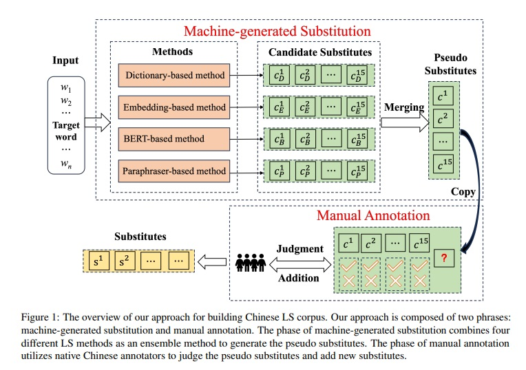
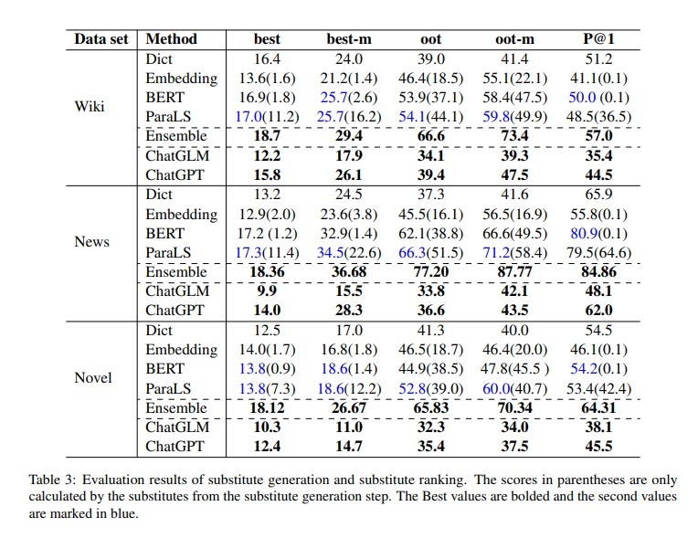

# Chinese Lexical Substitution: Dataset and Method
Existing lexical substitution (LS) benchmarks were collected by asking human annotators to think of substitutes from memory, resulting in benchmarks with limited coverage and relatively small scales. To overcome this problem, we propose a novel annotation method to construct an LS dataset based on human and machine collaboration. Based on our annotation method, we construct the first Chinese LS dataset CHNLS which consists of 33,695 instances and 144,708 substitutes, covering three text genres (News, Novel, and Wikipedia). Specifically, we first combine four unsupervised LS methods as an ensemble method to generate the candidate substitutes, and then let human annotators judge these candidates or add new ones. This collaborative process combines the diversity of machine-generated substitutes with the expertise of human annotators. Experimental results that the ensemble method outperforms other LS methods. To our best knowledge, this is the first study for the Chinese LS task\footnote{Code and data are available at https:}. 

# Install Instruction
### Transformers
Our method is build on transformers, based on custom modification of scripts. You need first follow the commands to install transformers
cd transformers-4.20.1_phrase_ahead_chinese
pip install -e .

### Other dependencies

pip install -r requirements.txt

# Models 

 [Embedding Model](https://github.com/Embedding/Chinese-Word-Vectors), need placed in models/

[DICT](https://pan.baidu.com/share/link?shareid=2858555949&uk=2738088569),haved placed in dataset/dict/

[Paraphraser](https://drive.google.com/file/d/1pXYDbVJQnVzjcLwGJzSWbX0dFtBqRStm/view?usp=sharing), need placed in bart-base-chinese/


[BERT](https://huggingface.co/bert-base-chinese), placed in bert-base-chinese/


# Run example for news category 

### Dict
```
python test.19.news.test.dictonary.py
```

### Embedding 
```
python test.19.news.test.embed.py
```
### ParaLS

```
python test.19.news.test.bart.ahead.py
```

### BERT
```
python test.19.news.test.bert.py
```

### Our Emsemble method
```
python test.19.news.sort.number.py
```

# Results



# Cite
```
@inproceedings{qiangchls,
title={Cross-task generalization via natural language crowdsourcing instructions},
author={ipeng Qiang and Kang Liu and Yin Li and Yun Li and Yunhao Yuan and Yi Zhu
Xiaoye Ouyang and Xiaocheng Hu},
booktitle={EMNLP},
year={2023}
}
```

# Contact

If you have any question. Please contact yzunlplk@163.com.
